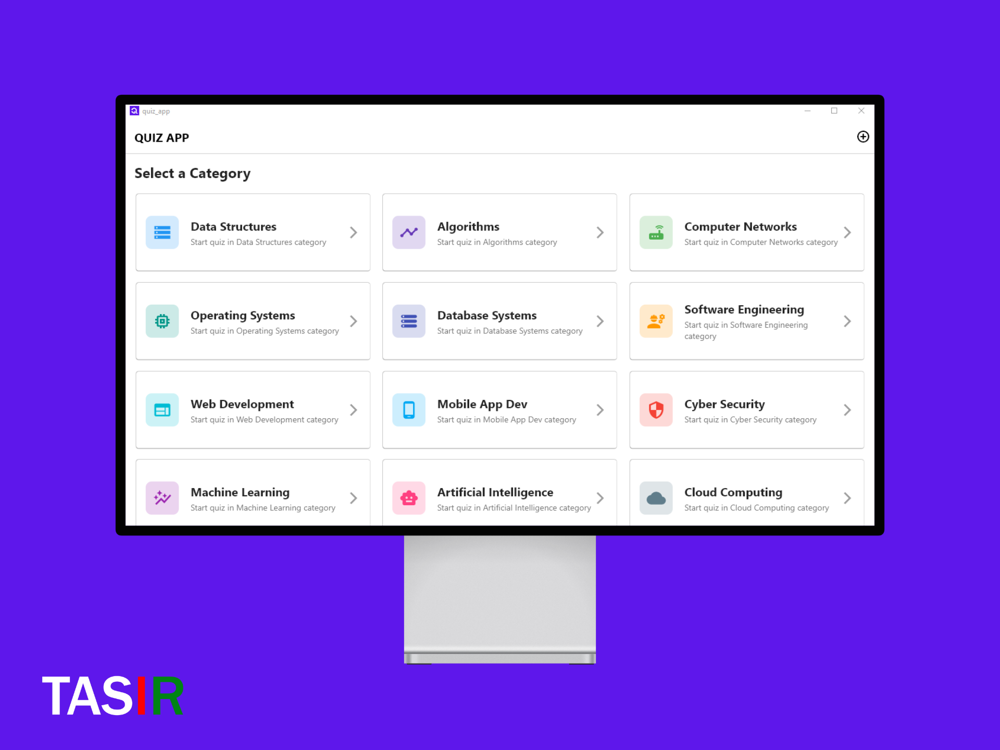
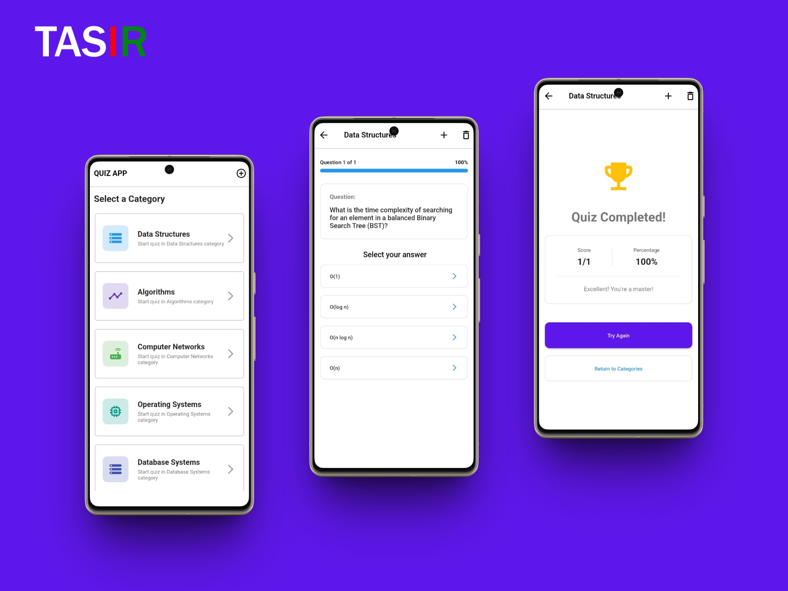
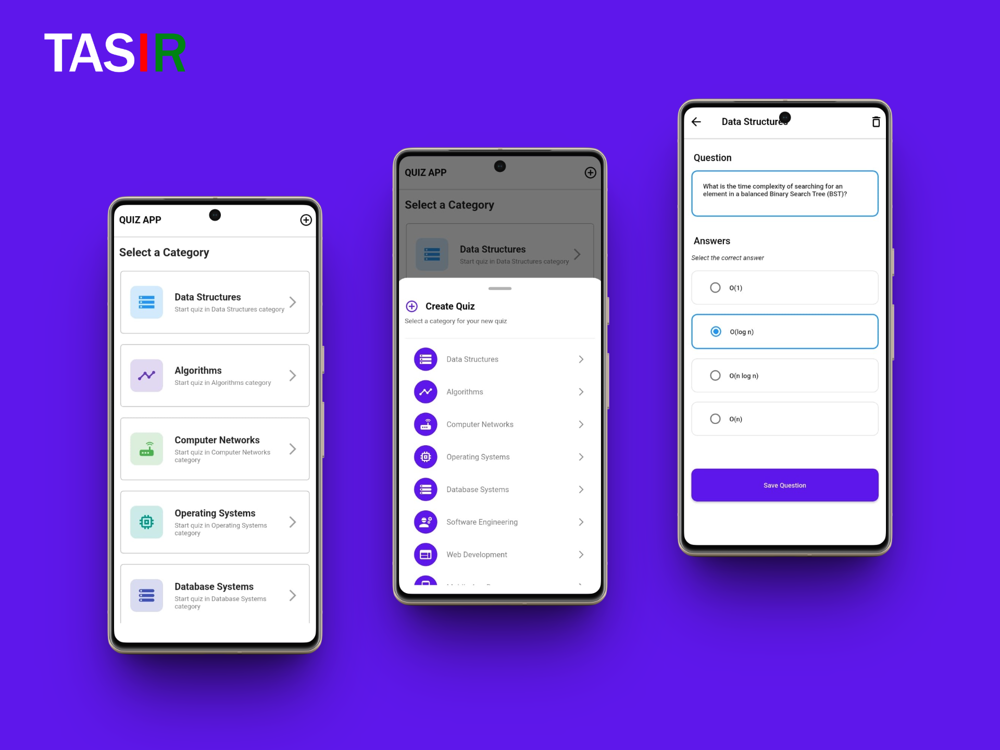

# QUIZ APP

A Flutter-based quiz application built to deepen understanding of Dart object-oriented programming (OOP), state management using Provider, and scalable UI development.

---

## 🧠 Purpose

This project serves as a hands-on learning tool to:

- Apply Dart OOP principles in real-world UI logic.
- Practice clean architecture and separation of concerns.
- Explore state management using the **Provider** package for managing application state efficiently.
- Persist user data such as quiz scores and preferences locally using **shared_preferences**.
- Customize and manage app launcher icons effortlessly using **flutter_launcher_icons**.
- Develop and structure reusable widgets in a Flutter project while maintaining scalable and maintainable code.

---

## 🛠️ Features

- Multiple-choice quiz interface
- Score tracking and result evaluation
- State management with **Provider**
- Reusable components and clean folder structure
- Follows Dart OOP and Flutter best practices

---

## 🧰 Tools

- Flutter (UI Toolkit)
- Dart    (Programming Language)
- Logo    (AI Tools from Together.ai)

---

## 🤖 Ai Assistants

- Claudi
- ChatGPT

---

## 🖼️ Preview

---

## Project Status

- Android App - Stable
- Windows App - Stable
- Website     - Stable

---

## 📦 Download - Android App / Windows / Web

[DOWNLOAD](doc/applications/)

---

## 📄 License

This project is licensed under the terms of the [MIT License](doc/README.md).